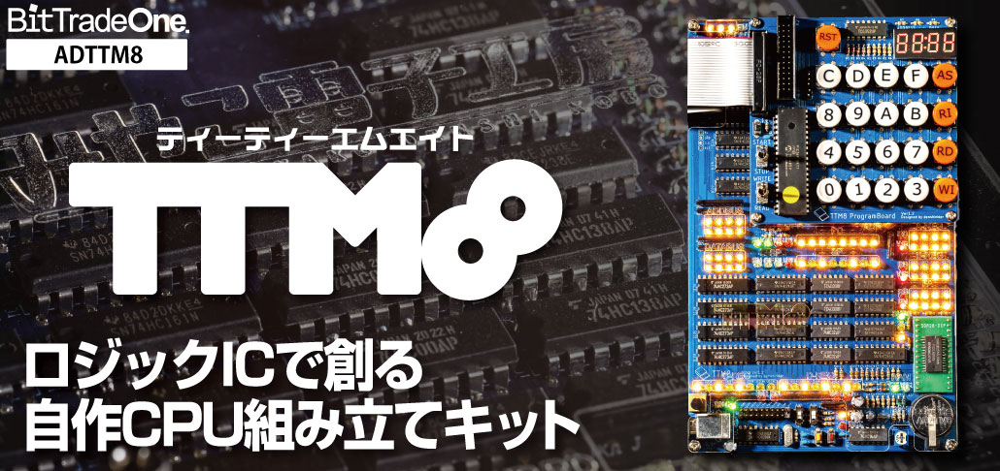
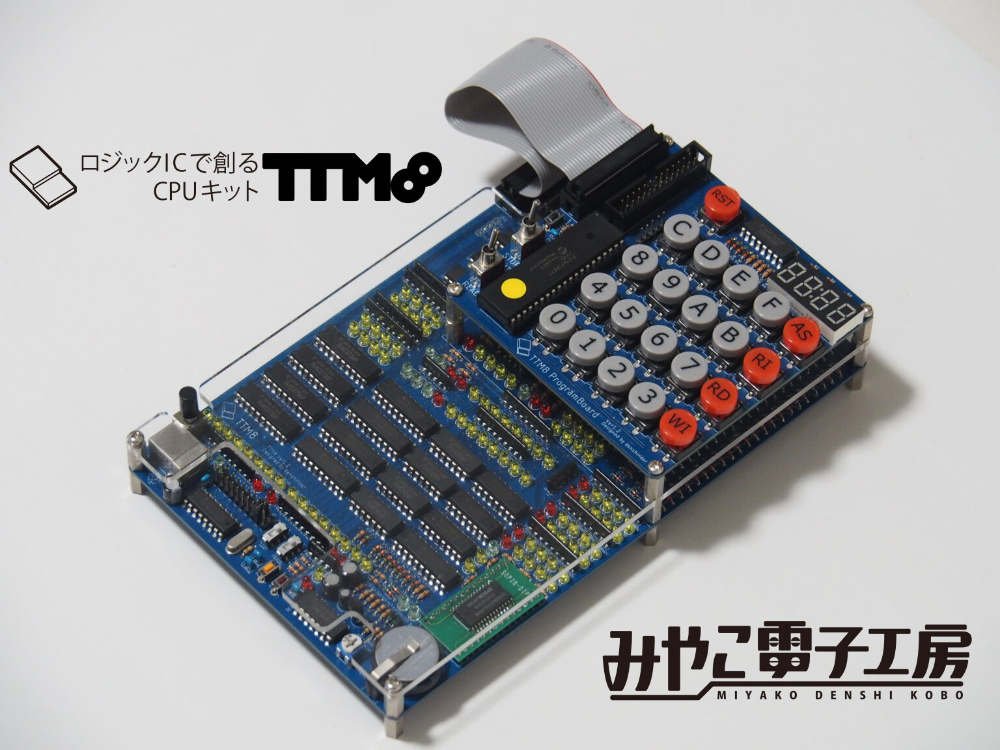
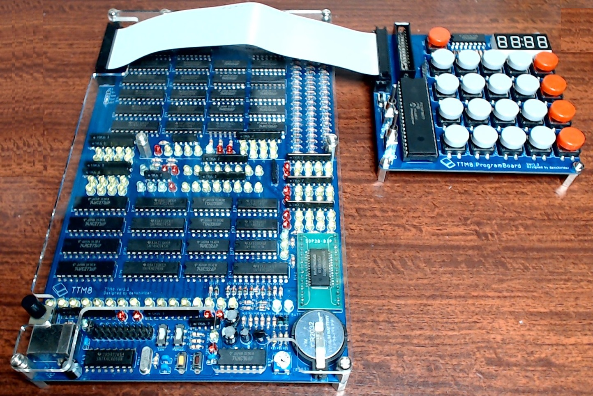
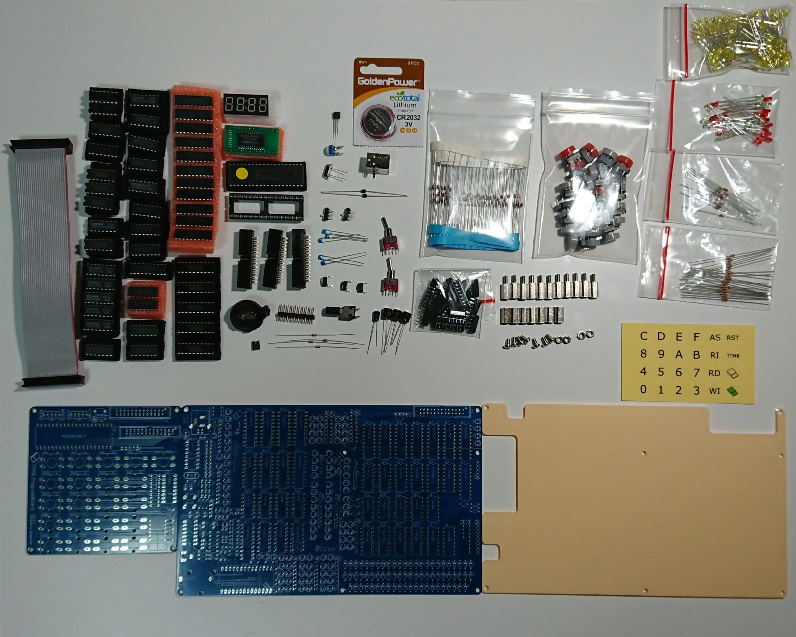

# ロジックICで創る自作CPU組み立てキットTTM8

## TTM8シリーズ商品リスト

<dl>
  <dt>ADTTM8</dt>
  <dd>はんだづけ組み立てキット</dd>
  <dt>ADTTM8B</dt>
  <dd>はんだづけ組み立てキット ＋ 解説本のセット</dd>
</dl>

### **製品ページは[こちら](https://bit-trade-one.co.jp/adttm8/)**

### **購入ページは[こちら](https://btoshop.jp/products/adttm8)**

# TTM8シリーズ関連リンク

### TTM8解説本のみ購入先

https://www.amazon.co.jp/TTM8%E5%AE%9F%E8%B7%B5%E8%A7%A3%E8%AA%AC-%E6%B1%8E%E7%94%A8%E3%83%AD%E3%82%B8%E3%83%83%E3%82%AFIC%E3%82%AD%E3%83%83%E3%83%88%E3%81%A7%E5%89%B5%E3%82%8B%E8%87%AA%E4%BD%9CCPU-%E9%9B%BB%E5%AD%90%E3%83%A9%E3%82%A4%E3%83%80%E3%83%BC/dp/4295600911/

### 設計者のホームページ

https://www.miyakodenshikobo.com/product/hardware/ttm8/

# ファイルリスト
- Readme.md             ［本文書］

- manual - TTM8_manual_1_2.pdf [取扱説明書]

- manual - TTM8_assembly_manual_1_2.pdf [組立説明書]

- TTM8_Assembler.xlsx [TTM8専用アセンブラ]

# 製品仕様

【本体寸法】W130×D210×H40【重量】約410g

【電源電圧】5V＊ 1A以上のUSB ACアダプタかモバイルバッテリが必要です。

【バックアップ電池】CR2032【消費電流】1 A 以下

【bit 数】8 bit【命令種類】16 種類

【総レジスタ数】：10 個【汎用レジスタ数】：2個

【1プログラムにおける最大命令数】：64 命令

【スタックおよびユーザ操作用RAM 領域】：32 Byte

【クロック】：ジャンパーピンとスイッチにて選択   段階的に250 kHz から244 Hz、低周波クロック、手動クロック

【入出力】：なし（拡張して任意のI/O を付与できる）

【想定組立時間】：はんだづけ作業5～6時間

【生産国】日本

【付属品】部品表、取扱説明書と組み立て説明書へのQRコード ＊別途、電源として １A以上のUSB ACアダプタかモバイルバッテリの他、接続のためのUSB-Bケーブルが必要です。

# コミニティ

ユーザ間のコミニティサイトとして、本リポジトリのGithub Discussionsを使用します。

スレ立てはご自由に。

**[discussionsページ](https://github.com/denshirider/TTM8/discussions)**

 

***

<!--  -->

